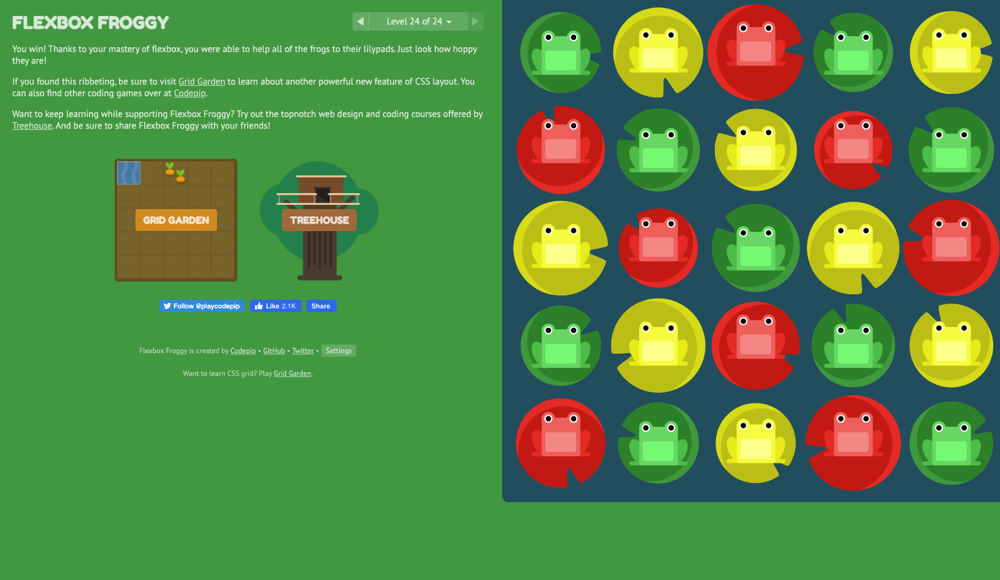

# Class 3

## [Home Page](../README.md)

#### References:

https://1sherlynn.medium.com/javascript-templating-language-and-engine-mustache-js-with-node-and-express-f4c2530e73b2

https://css-tricks.com/snippets/css/a-guide-to-flexbox/

https://flexboxfroggy.com/

## Javascript Templating Language and Engine— Mustache.js with Node and Express

by Sherlynn Tan

### Javascript Templating

fast and efficient technique to render client-side view templates with Javascript by using a JSON data source

Mustache
- logic-less template syntax
- works by expanding tags in a template using values provided in a hash or object
- no if statements, else clauses, or for loops
- only tags

mustache.js is an implementation of the mustache template system in JavaScript

- Mustache is NOT a templating engine. Mustache is a specification for a templating language

## A Complete Guide to Flexbox 

by Chris Coyier

### Properties for the Parent (flex container)

display
- This defines a flex container; inline or block depending on the given value. It enables a flex context for all its direct children.

flex-direction

- This establishes the main-axis, thus defining the direction flex items are placed in the flex container. Flexbox is (aside from optional wrapping) a single-direction layout concept. Think of flex items as primarily laying out either in horizontal rows or vertical columns.

flex-wrap

- wrap - will wrap, nowrap - wont wrap

flex-flow
- This is a shorthand for the flex-direction and flex-wrap properties, which together define the flex container’s main and cross axes. The default value is row nowrap.

justify-content

- This defines the alignment along the main axis. It helps distribute extra free space leftover when either all the flex items on a line are inflexible, or are flexible but have reached their maximum size. It also exerts some control over the alignment of items when they overflow the line.

align-items

- This defines the default behavior for how flex items are laid out along the cross axis on the current line. Think of it as the justify-content version for the cross-axis (perpendicular to the main-axis).

align-content

- This aligns a flex container’s lines within when there is extra space in the cross-axis, similar to how justify-content aligns individual items within the main-axis.

### Properties for the Children (flex items)

order

- By default, flex items are laid out in the source order. However, the order property controls the order in which they appear in the flex container.

flex-grow

- This defines the ability for a flex item to grow if necessary. It accepts a unitless value that serves as a proportion. It dictates what amount of the available space inside the flex container the item should take up.

If all items have flex-grow set to 1, the remaining space in the container will be distributed equally to all children. If one of the children has a value of 2, the remaining space would take up twice as much space as the others (or it will try to, at least).

flex-shrink

- This defines the ability for a flex item to shrink if necessary.

flex-basis

- his defines the default size of an element before the remaining space is distributed

flex

- This is the shorthand for flex-grow, flex-shrink and flex-basis combined

align-self

- This allows the default alignment (or the one specified by align-items) to be overridden for individual flex items.

### Flexbox Froggy 

