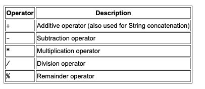

# The Java™ Tutorials

## Reference 

https://docs.oracle.com/javase/tutorial/java/nutsandbolts/index.html

https://www.reddit.com/r/explainlikeimfive/comments/233dq5/eli5_what_does_it_mean_to_compile_code/ 

## Language Basics

### Variables

- variable naming rules and conventions, 
- basic data types 
    - primitive types 
    - character strings
    - arrays
- default values
- literals

"object stores its state in fields"

- Instance Variables (Non-Static Fields)
    - fields declared without the static keyword
    - also known as instance variables
        - values are unique to each instance of a class
- Class Variables (Static Fields)
    - any field declared with the static modifier
    - there is exactly one copy of this variable in existence, regardless of how many times the class has been instantiated.
- Local Variables
    - declaring a local variable is similar to declaring a field
    - There is no special keyword designating a variable as local
    - determination comes entirely from the location in which the variable is declared
    - local variables are only visible to the methods in which they are declared
- Parameters
    - parameters are always classified as "variables" not "fields"

#### Naming
- Variable names are case-sensitive 
    - you can name your variables anything you want with an unlimited number of characters, letters, numbers, $ or _ , but avoid using the $ and the _ character as the first character. 
    - Subsequent characters may be letters, digits, dollar signs, or underscore characters
    - If the name you choose consists of only one word, spell that word in all lowercase letters 
        -  If it consists of more than one word, capitalize the first letter of each subsequent word

### Primitive Data Types

- 'The Java programming language is statically-typed, which means that all variables must first be declared before they can be used

- byte 
- short 
- int 
- long 
- float 
- double
- boolean
- char'

#### Default Values

- byte - 0
- short - 0
- int - 0
- long  - 0L
- float  - 0.0f
- double - 0.0d
- boolean - false
- char - '/u0000'

#### Literals - 
- 'A literal is the source code representation of a fixed value'
- 'the new keyword isn't used when initializing a variable of a primitive type'

#### Integer Literals
- 'An integer literal is of type long if it ends with the letter L or l; otherwise it is of type int. It is recommended that you use the upper case letter L because the lower case letter l is hard to distinguish from the digit 1.'

#### Floating-Point Literals
- 'A floating-point literal is of type float if it ends with the letter F or f; otherwise its type is double and it can optionally end with the letter D or d.'

#### Character and String Literals
- 'Literals of types char and String may contain any Unicode (UTF-16) characters. If your editor and file system allow it, you can use such characters directly in your code. If not, you can use a "Unicode escape" such as '\u0108' (capital C with circumflex), or "S\u00ED Se\u00F1or" (Sí Señor in Spanish). Always use 'single quotes' for char literals and "double quotes" for String literals. Unicode escape sequences may be used elsewhere in a program (such as in field names, for example), not just in char or String literals.'

#### Using Underscore Characters in Numeric Literals
- 'In Java SE 7 and later, any number of underscore characters (_) can appear anywhere between digits in a numerical literal. This feature enables you, for example. to separate groups of digits in numeric literals, which can improve the readability of your code.'

### Arrays

- 'An array is a container object that holds a fixed number of values of a single type. The length of an array is established when the array is created. After creation, its length is fixed. You have seen an example of arrays already, in the main method of the "Hello World!" application. This section discusses arrays in greater detail.'
    - 'Each item in an array is called an element, and each element is accessed by its numerical index'

#### Declaring a Variable to Refer to an Array
- 'Like declarations for variables of other types, an array declaration has two components: the array's type and the array's name. An array's type is written as type[], where type is the data type of the contained elements; the brackets are special symbols indicating that this variable holds an array. The size of the array is not part of its type (which is why the brackets are empty). An array's name can be anything you want, provided that it follows the rules and conventions as previously discussed in the naming section'

#### Creating, Initializing, and Accessing an Array
```
// create an array of integers

anArray = new int[10];
```

#### Copying Arrays 
```
public static void arraycopy(Object src, int srcPos,
                             Object dest, int destPos, int length)
```

#### Array Manipulations 
```
class ArrayCopyOfDemo {
    public static void main(String[] args) {
        
        char[] copyFrom = {'d', 'e', 'c', 'a', 'f', 'f', 'e',
            'i', 'n', 'a', 't', 'e', 'd'};
            
        char[] copyTo = java.util.Arrays.copyOfRange(copyFrom, 2, 9);
        
        System.out.println(new String(copyTo));
    }
}
```
### Operators

- Operators are special symbols that perform specific operations on one, two, or three operands, and then return a result.


### Assignment, Arithmetic, and Unary Operators

#### The Simple Assignment Operator

- ' One of the most common operators that you'll encounter is the simple assignment operator "=".'

#### The Arithmetic Operators



#### The Unary Operators


### Equality, Relational, and Conditional Operators

#### The Equality and Relational Operators

```
==      equal to
!=      not equal to
>       greater than
>=      greater than or equal to
<       less than
<=      less than or equal to
```

#### The Conditional Operators

```
&& Conditional-AND
|| Conditional-OR
```

#### The Type Comparison Operator instanceof
- 'The instanceof operator compares an object to a specified type. You can use it to test if an object is an instance of a class, an instance of a subclass, or an instance of a class that implements a particular interface.'

### Bitwise and Bit Shift Operators
- 'The unary bitwise complement operator "~" inverts a bit pattern; it can be applied to any of the integral types, making every "0" a "1" and every "1" a "0". For example, a byte contains 8 bits; applying this operator to a value whose bit pattern is "00000000" would change its pattern to "11111111".'

### Expressions, Statements, and Blocks

#### Expressions
- 'An expression is a construct made up of variables, operators, and method invocations, which are constructed according to the syntax of the language, that evaluates to a single value.'

#### Statements
- Statements are roughly equivalent to sentences in natural languages. A statement forms a complete unit of execution

#### Blocks
- A block is a group of zero or more statements between balanced braces and can be used anywhere a single statement is allowed

### Control Flow Statements


- 'The if-then statement is the most basic of all the control flow statements. It tells your program to execute a certain section of code only if a particular test evaluates to true. The if-then-else statement provides a secondary path of execution when an "if" clause evaluates to false. Unlike if-then and if-then-else, the switch statement allows for any number of possible execution paths. The while and do-while statements continually execute a block of statements while a particular condition is true. The difference between do-while and while is that do-while evaluates its expression at the bottom of the loop instead of the top. Therefore, the statements within the do block are always executed at least once. The for statement provides a compact way to iterate over a range of values. It has two forms, one of which was designed for looping through collections and arrays.'

### What does a compiler do?

'When you compile code, the compilor (usually another program) takes the program the human wrote, and converts it into the program the computer can understand (i.e. converts from Java to machine language). The very short version could be, yes, compile means to make the code executable.

Something you may run into is people saying code does or does not compile. This means the compilor they used checks to make sure their program is written correctly according to the rules of the programming language. For example, most programming languages make you put a semicolon (;) at the end of every line. A very common mistake is to forget that semicolon, so when you try and compile the compilor gives you an error.'